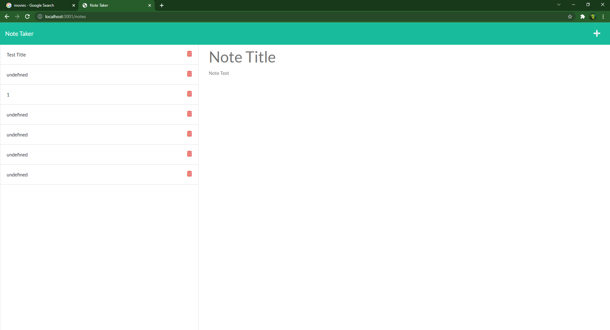
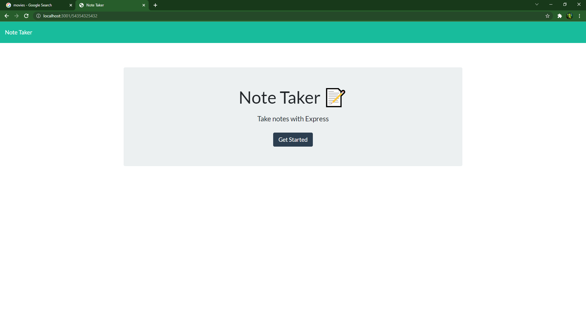

# hw11-Note-Taker

## Description
In this application we designed the back end portion of a note taker. We used express and Insomnia to test it out. On the back end we made the routes for our application to listen for.

## Table of Contents
- [Installation](#installation)
- [Usage](#usage)
- [License](#license)
- [Contribution](#contribution)
- [Test](#test)
- [Questions](#questions)

## Installation
open console and run npm i it should install all programs needed. If not open console and type in npm i express that is a package you need to run this app.

## Usage
You would use the application by typing in the header of whatever note you are taking and then move down to the body and type in the main part of the note.

## License
    This project is under the MIT license.

## Contribution
Express, Nodemon

## Test
You can run tests by typing in notes and submitting them and seeing if it works look into the console and see if they were submitted right.
  
## Questions
My GitHub is: [TannerOliver](https://github.com/TannerOliver)
You can reach me at Email: 435.tanner@gmail.com
Go Check out this app on Heroku [Click Me](https://hw11-note-taker-to.herokuapp.com/)